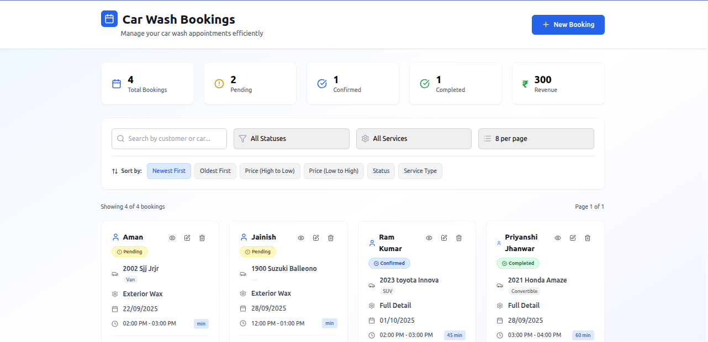
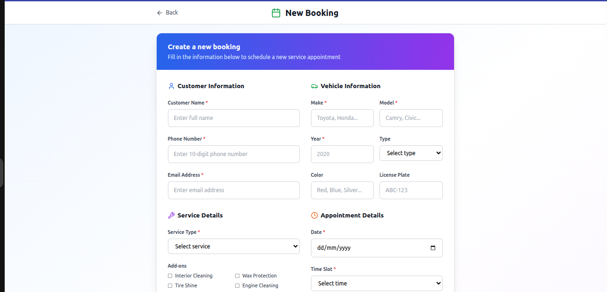
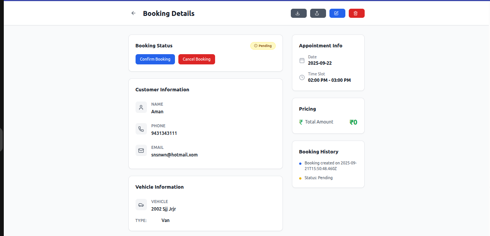

README: Description, features, tech stack, setup, docs, screenshots, live links, issues/limitations.# ASBL - Car Wash Booking System


Application is Live at -> https://car-washing-book.vercel.app/

## Description
ASBL is a full-stack Car Wash Booking application that allows users to schedule and manage car wash services efficiently. The system provides a dashboard for viewing, filtering, adding, editing, and deleting bookings. It also tracks revenue and booking statistics.  

---

## Features
- **Booking Management**: Add, edit, delete, and view bookings.
- **Car Details**: Store car make, model, year, type, color, and license plate.
- **Add-ons**: Optional services like Paint Protection, Leather Treatment, Interior Cleaning.
- **Filtering & Search**: Search bookings by customer or car and filter by status or service type.
- **Booking Statistics**: Total bookings, pending, confirmed, completed, and revenue.
- **Responsive Design**: Works on mobile, tablet, and desktop.
- **Environment Variables**: Securely configure API URLs and database connections.

---

## Tech Stack
- **Frontend**: React, React Router, Tailwind CSS, Lucide React icons
- **Backend**: Node.js, Express.js, MongoDB, Mongoose
- **Hosting**:  
  - Frontend: Vercel  
  - Backend: Render  
- **API Communication**: Axios

---
## Screenshots

### Home Page
[](./screenshots/HomePage.png)

### Booking Form
[](./screenshots/bookingForm.png)

### Booking Details
[](./screenshots/BookingDetails.png)


## Setup
1. Clone the repository:
   ```bash
   git clone https://github.com/<your-username>/ASBL.git